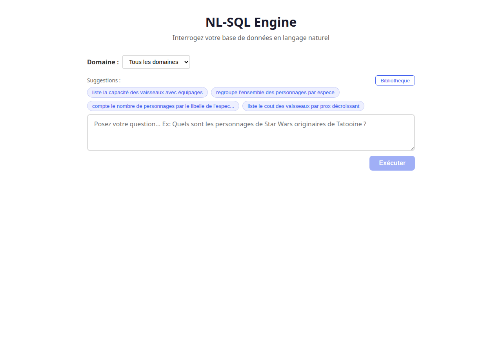
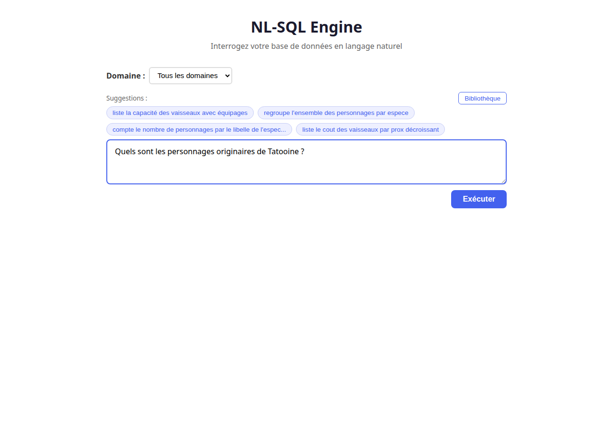
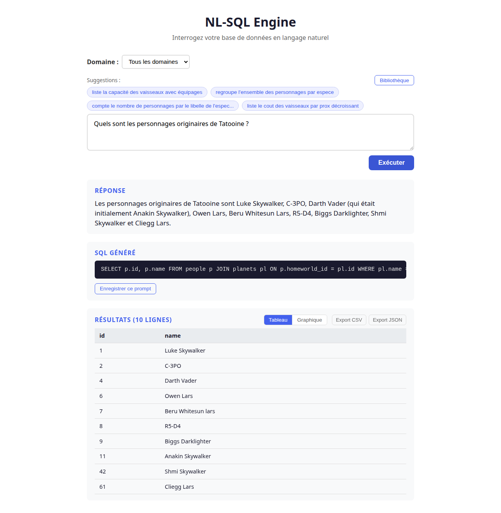
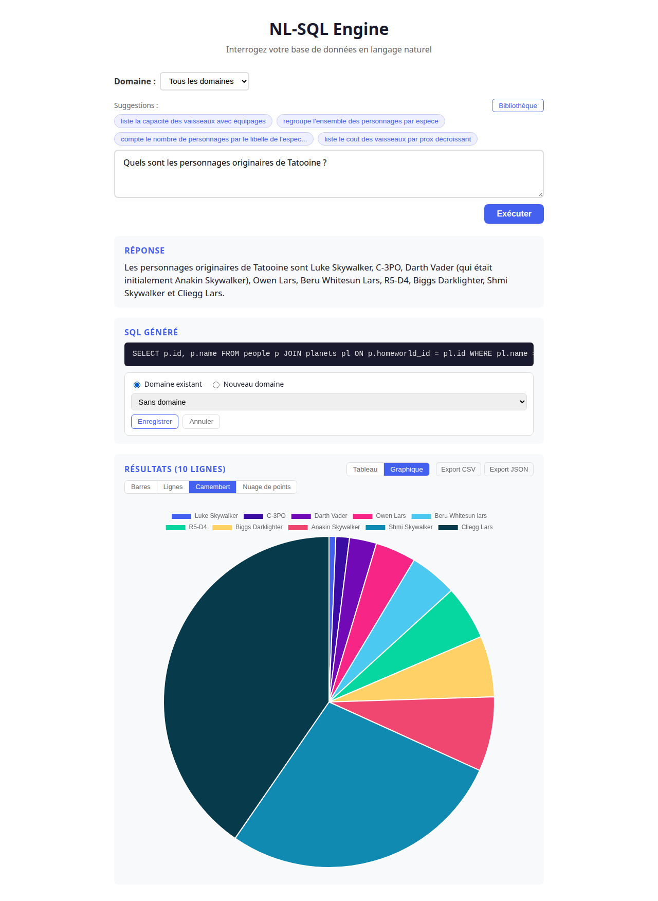
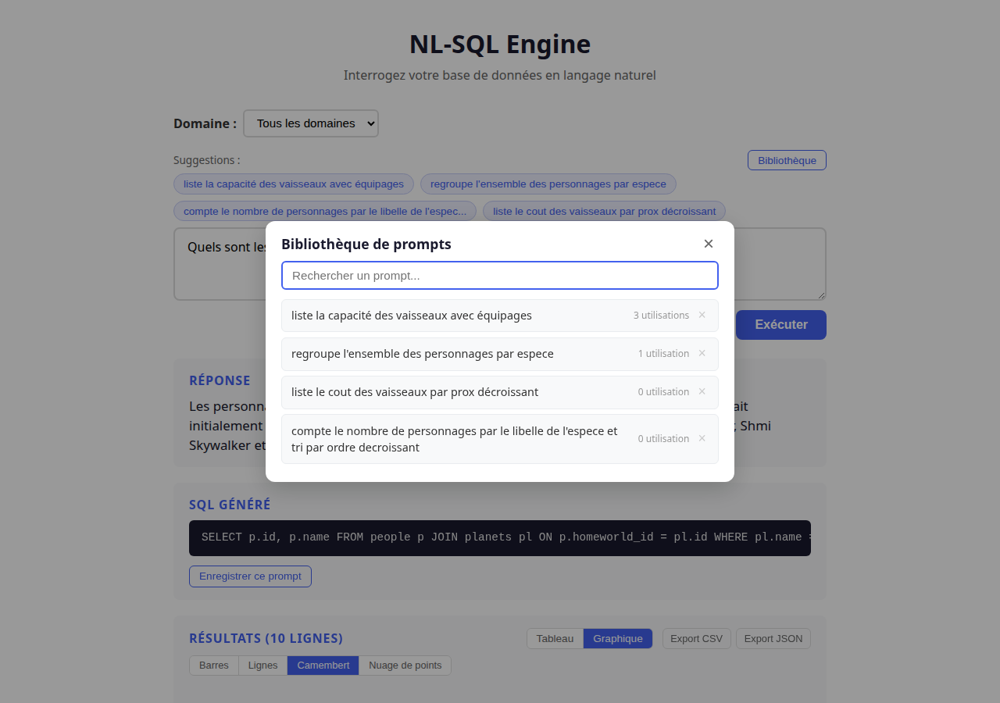
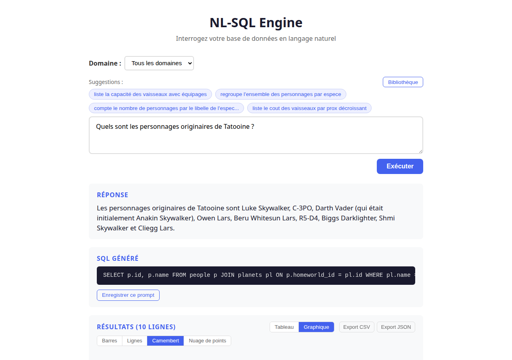

# NL-SQL Engine — Guide utilisateur

NL-SQL Engine permet d'interroger une base de données en posant des questions en langage naturel. L'application traduit automatiquement votre question en requête SQL, l'exécute et vous présente les résultats.

---

## 1. Page d'accueil

Au lancement, l'interface présente :
- Un **sélecteur de domaine** pour filtrer le contexte de recherche
- Des **suggestions** de prompts populaires sous forme de chips cliquables
- Un bouton **Bibliothèque** pour accéder aux prompts enregistrés
- Une **zone de saisie** pour taper votre question en langage naturel



---

## 2. Poser une question

Saisissez votre question dans la zone de texte. Vous pouvez aussi cliquer sur l'une des suggestions pour pré-remplir le champ.

Appuyez sur **Entrée** ou cliquez sur le bouton **Exécuter** pour lancer la requête.

> **Astuce** : Utilisez **Shift+Entrée** pour insérer un retour à la ligne sans exécuter.



---

## 3. Consulter les résultats

Après exécution, l'interface affiche trois sections :

1. **Réponse** — Un résumé en langage naturel de la réponse à votre question
2. **SQL généré** — La requête SQL produite par le moteur, avec la possibilité de l'enregistrer
3. **Résultats** — Les données retournées sous forme de tableau paginé et triable

Le tableau est **triable** : cliquez sur un en-tête de colonne pour trier par ordre croissant ou décroissant. La pagination se fait par blocs de 20 lignes.

Vous pouvez **exporter** les résultats via les boutons **Export CSV** et **Export JSON**.



---

## 4. Visualisation graphique

Cliquez sur le bouton **Graphique** pour basculer de la vue tableau à une visualisation Chart.js.

Le type de graphique est **détecté automatiquement** selon la nature des données :
- 1 colonne texte + 1 colonne numérique (10 lignes ou moins) : **camembert**
- 1 colonne texte + 1+ colonnes numériques : **barres**
- 1 colonne date + colonnes numériques : **lignes**
- 2 colonnes numériques : **nuage de points**
- Données sans colonnes numériques : **comptage de fréquence** automatique

Vous pouvez **forcer un type de graphique** en cliquant sur les boutons Barres, Lignes, Camembert ou Nuage de points.


---

## 5. Enregistrer un prompt

Après un résultat réussi, cliquez sur **Enregistrer ce prompt** sous le SQL généré. Un formulaire s'affiche pour rattacher le prompt à un domaine :

- **Domaine existant** — sélectionnez un domaine dans la liste déroulante
- **Nouveau domaine** — saisissez le nom du nouveau domaine, il sera créé automatiquement
- **Sans domaine** — laissez la sélection par défaut

Le prompt enregistré sera ensuite disponible dans les suggestions et dans la bibliothèque.



---

## 6. Bibliothèque de prompts

Cliquez sur le bouton **Bibliothèque** pour ouvrir la liste complète des prompts enregistrés.

Fonctionnalités :
- **Recherche** en temps réel par mot-clé
- **Compteur d'utilisations** affiché pour chaque prompt
- **Clic** sur un prompt pour le charger dans la zone de saisie
- **Suppression** d'un prompt via le bouton **x** à droite

La bibliothèque est filtrée par le domaine sélectionné. Pour voir tous les prompts, choisissez "Tous les domaines".



---

## 7. Domaines fonctionnels

Le sélecteur de domaine en haut de page permet de **filtrer le contexte** envoyé au moteur d'intelligence artificielle.

En sélectionnant un domaine :
- Les **suggestions** affichent uniquement les prompts populaires de ce domaine
- La **bibliothèque** est filtrée par domaine
- Le moteur RAG ne récupère que les **schémas pertinents** au domaine, ce qui améliore la qualité de la génération SQL



---

## Raccourcis clavier

| Raccourci | Action |
|-----------|--------|
| `Entrée` | Exécuter la question |
| `Shift+Entrée` | Retour à la ligne dans la zone de saisie |

---

## Régénérer les captures d'écran

Les captures d'écran de cette documentation sont générées automatiquement via Playwright :

```bash
# Prérequis : frontend et backend en cours d'exécution
cd /chemin/vers/dev
FRONT_URL=http://localhost:3000 node screenshots.mjs
```

Les images sont enregistrées dans le répertoire `../images/`.
